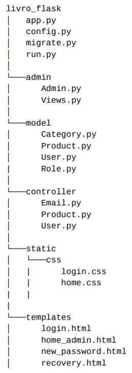

<h1 align="center">flask-application-products</h1>
<p>
  
  <a href="MIT" target="_blank">
    
  </a>
</p>

> flask application with sqlalchemy

## Author

👤 **leandro-matos**

* Website: https://www.gitshowcase.com/leandro-matos
* Github: [@leandro-matos](https://github.com/leandro-matos)

## ** project structure **



Copyright © 2020 [leandro-matos](https://github.com/leandro-matos).<br />
This project is [MIT](MIT) licensed.

***

## ** Execute **

```
git clone https://github.com/leandro-matos/flask-application
cd flask-application
virtualenv venv
.\venv\Scripts\activate
pip install -r requirements.txt
set FLASK_ENV=development
python3 app.py
```

_This README was generated with ❤️ by [readme-md-generator](https://github.com/kefranabg/readme-md-generator)_